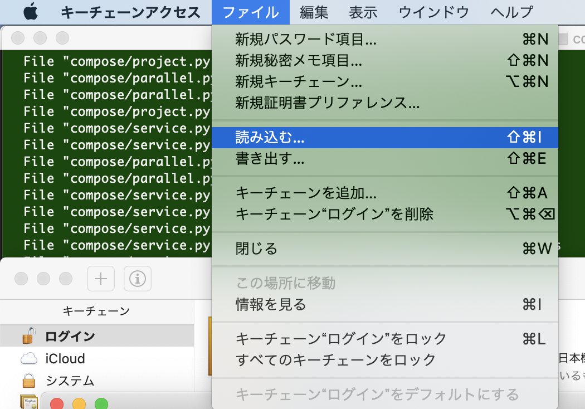
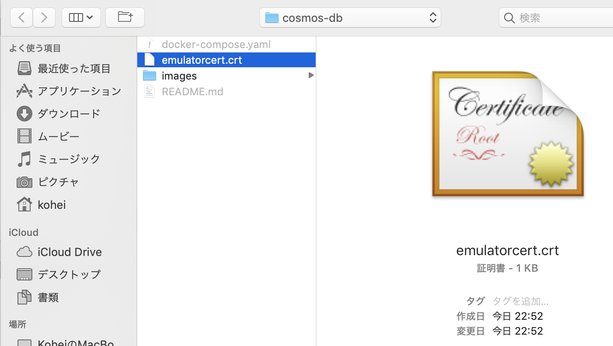
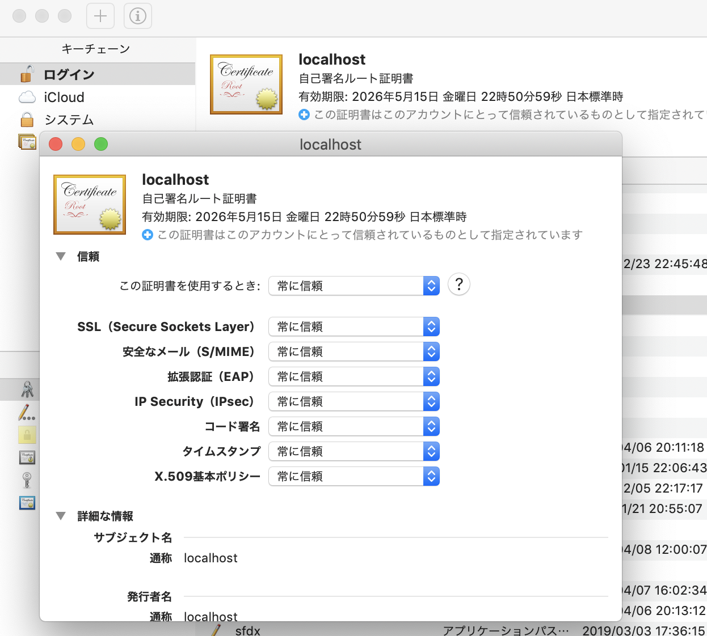
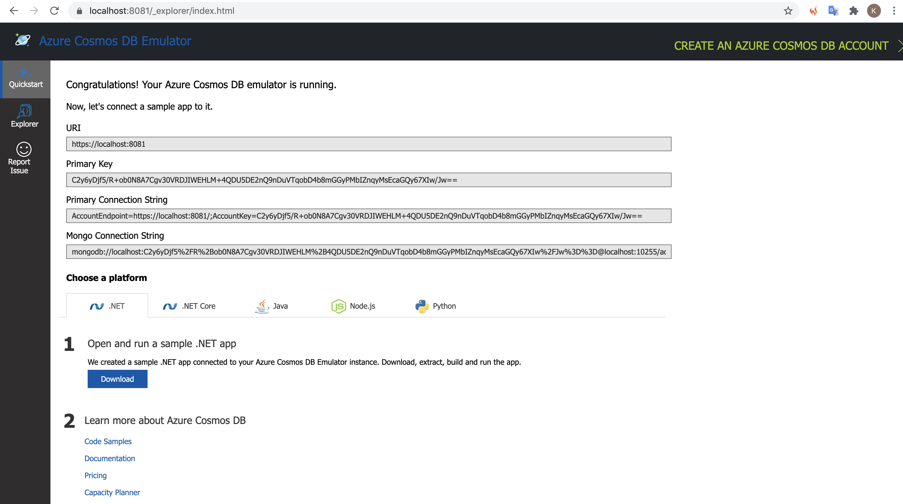
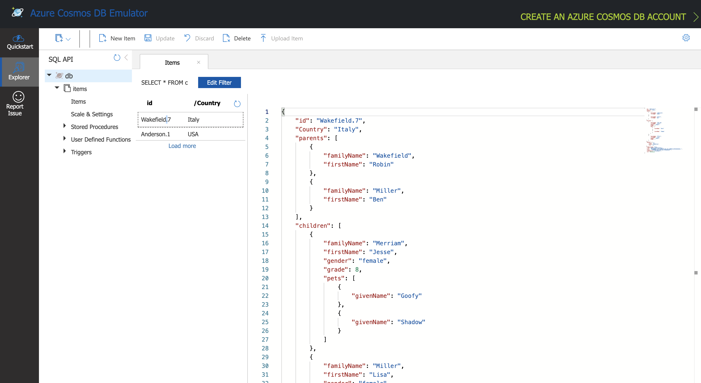

# Cosmos DB Emulator on macOS

## Prerequisites

```shell
$ npm -v
6.14.11

$ node --version
v12.21.0
```

## Get Local IP Address

```shell
ipaddr="`ifconfig | grep "inet " | grep -Fv 127.0.0.1 | awk '{print $2}' | head -n 1`"
```

## Create docker-compose.yaml

```yml
version: '3.1'
# version: 2

services:
  linux-emulator:
    image: mcr.microsoft.com/cosmosdb/linux/azure-cosmos-emulator:latest
    container_name: azure-cosmos-emulator
    tty: true
    ports:
      - 8081:8081
      - 10251:10251
      - 10252:10252
      - 10253:10253
      - 10254:10254
    environment:
      - AZURE_COSMOS_EMULATOR_PARTITION_COUNT=10
      - AZURE_COSMOS_EMULATOR_ENABLE_DATA_PERSISTENCE=true
      - AZURE_COSMOS_EMULATOR_IP_ADDRESS_OVERRIDE=$ipaddr
    # cpus: "2.0" # Use this param at v2
    # mem_limit: 3g # Use this param at v2
    deploy: # Use these param at v3 & add `–compatibility` when compose up
      resources:
        limits:
          cpus: "2.0"
          memory: 3g
```

## Launch containers

```shell
docker-compose --compatibility up -d
```

Confirm containers are up.

```shell
docker-compose ps
```

## Install certificate

```shell
curl -k https://$ipaddr:8081/_explorer/emulator.pem > emulatorcert.crt
```

## Trust settings







## Access web UI

connect <https://localhost:8081/_explorer/index.html>



## Run Node.js application

```shell
NODE_TLS_REJECT_UNAUTHORIZED="0" npm start
```

Confirm new items are created.



## References

 1. [AzureCosmosDBLinuxEmulatorGist.md](https://gist.github.com/StefArroyo/86a87056300fa58c2042e84cdfaa0e1c#file-azurecosmosdblinuxemulatorgist-md)